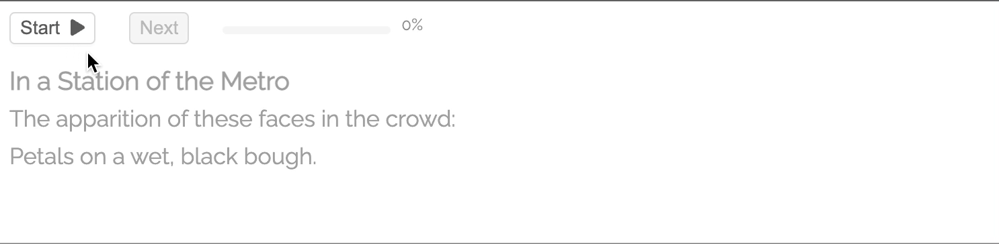

# Soliloquy: A Tool to Visualize the Think Aloud



This repo is a work-in-progress. I hope to update it more in the near future.

If you are in a hurry, run `npm start` for a brief demo. Examples of how to use Soliloquy on a webpage is in the `public` folder. 

### Paper
[[LINK]](https://doi.org/10.1145/3544548.3581374) Read about Soliloquy in our CHI Paper

## Adding to Webpage

To use Soliloquy, the JS and CSS files to include can be found in `build/embed`.

This will add the `soliloquy` object to the window object (global variable)

## Configuring Soliloquy Data

Using Soliloquy requires providing a JS Object with all relevant data and settings. See the `exampleConfig.json`

`text` (obj)- You will need provide an object with `title` (string) and `lines` (array) properties. Title acts as a line but has different formatting.

`linesTA` (array) - This is all the instructions for the interface, an array of an objects representing every single line (including the title). Example below:

```
{
    "order": [1, 4], //(Array) When the lines are read (this entry is read first and fourth)
    "tooltips": [{   //(Array of Objects)
      "lnOrder": 4, // Which line order this triggers (this will trigger after the second time this line is read, after the fourth line overall )
      "range": [1, 3], // which words are highlighted (in this case the first 3 words)
      "content": "This thought appears on the second reading of the line"// (content of the thought)
    }]
}
```

## Rendering Soliloquy

To render the tool, call the `renderThinkAloud` and provide an id of a div to render to and the config data mentioned above. Example below:

```
<script>
    function ready(fn) {
        if (document.readyState != 'loading'){
        fn();
        } else {
        document.addEventListener('DOMContentLoaded', fn);
        }
    }

    ready(function(){
        soliloquy.renderThinkAloud("soliloquy", data);
    });
</script>

<div id="soliloquy"></div>
```

## Listening to Soliloquy Events

There's a few event handlers for Soliloquy based on Redux state changes. At the moment this is a work in progress, but an "ALL" handler will emit all Redux changes.

```
soliloquy.on("onComplete", (action, state) => {
    console.log(state);
});
soliloquy.on("ALL", (action, state) => {
    console.log(action);
});
```

## Misc Settings

The config data passed to `renderThinkAloud` has a few more propeties to affect timing.

`commaDelay`: (int) milliseconds delay to add for various punctuation

`lineDelay`: (int) milliseconds delay after the end of each line

`wordDelay`: (int) milliseconds delay after each word


## Author
Author - Zak Risha [zrisha](https://github.com/zrisha)

This project was bootstrapped with [Create React App](https://github.com/facebook/create-react-app).
